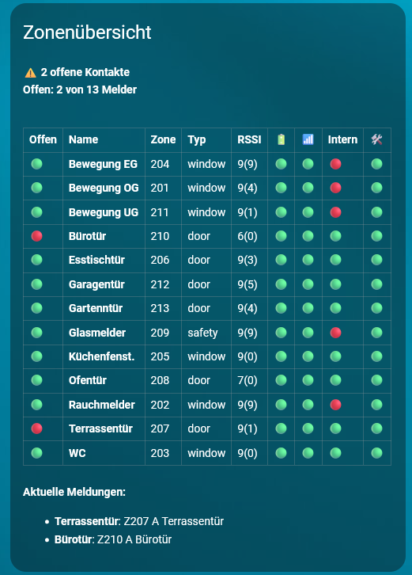

# ABUS Secvest für Home Assistant

Custom Integration zur Anbindung einer ABUS Secvest Alarmanlage an Home Assistant.

Diese Integration ist nicht offiziell von ABUS und nicht mit ABUS verbunden.

Vielen Dank an Jochen aka Birdy aus dem alarmforum.de. Er hat mir seine Dateien zur Verfügung gestellt und ich habe einige seiner Ideen in diese Integration übernommen.

## Funktionen

- Alarmzentrale für Scharf, Teilscharf und Unscharf
- Melder und Zonen als Binary Sensors
- Übersicht offener Melder
- RSSI-/Funksignalwerte für Funkmelder
- Batterie-, Funk-, Sabotage- und Supervisionsstatus
- Interne Überwachung und Ausblendbarkeit der Melder
- Fault-Abfrage und Zuordnung von Meldungen zu einzelnen Zonen
- Ausgänge der Secvest als Diagnoseinformationen
- Buttons für Aktualisierung und Fault-Quittierung
- Einrichtung und Optionen über die Home-Assistant-Oberfläche
- Einstellbare Abfrageintervalle
- Lokales Polling ohne Cloud
- Deutsch- und englischsprachige Oberfläche
- Diagnoseexport zur Fehlersuche

## Neu in Version 0.2.22

- RSSI-/Funksignalwerte für Secvest-Funkmelder hinzugefügt
- Optionalen separaten Web-Benutzer für RSSI-Abfragen ergänzt
- Anmeldung an der Secvest-Weboberfläche einschließlich Session und CSRF unterstützt
- Web-Session wird wiederverwendet, um wiederholte Anmeldungen zu vermeiden
- Letzte gültige RSSI-Werte bleiben bei kurzzeitigen Verbindungsfehlern erhalten
- Parallele Web-Anmeldungen werden verhindert
- Leere und nicht belegte Funkzonen werden ausgefiltert
- Diagnoseinformationen für Web-Session und RSSI erweitert
- Stabilität der normalen REST- und Zonenabfragen verbessert
- Deutsche und englische Konfigurationstexte überarbeitet

## Installation über HACS

1. HACS in Home Assistant öffnen.
2. Zu **Integrationen** wechseln.
3. Das Drei-Punkte-Menü öffnen und **Benutzerdefinierte Repositories** wählen.
4. Diese Repository-URL eintragen:

   ```text
   https://github.com/dkmouk/secvest-ha
   ```

5. Als Kategorie **Integration** auswählen.
6. **ABUS Secvest** installieren.
7. Home Assistant neu starten.
8. Die Integration über **Einstellungen > Geräte & Dienste > Integration hinzufügen > ABUS Secvest** hinzufügen.

## Manuelle Installation

Den Ordner der Integration nach Home Assistant kopieren:

```text
custom_components/secvest/
```

Danach Home Assistant neu starten.

## Grundkonfiguration

Beispiel für den Host:

```text
https://192.168.2.22:4433
```

Bei neueren Secvest-Firmware-Versionen muss im Feld **Benutzername / Code** gegebenenfalls der Benutzer-Code eingetragen werden.

Empfohlene Abfrageintervalle:

- Status-Intervall: `10` Sekunden
- Melder-/Zonen-Intervall: `10` Sekunden

Wenn die Secvest instabil oder träge reagiert, beide Werte auf `15` oder `30` Sekunden erhöhen.

## RSSI und Funkstatus

Für das Auslesen der RSSI-Werte verwendet die Integration zusätzlich die lokale Secvest-Weboberfläche.

Unter den Optionen der Integration können dafür separate Zugangsdaten eingetragen werden:

- **Web-Benutzer / Code (nur RSSI)**
- **Web-Passwort (nur RSSI)**

Es wird empfohlen, dafür einen separaten, eingeschränkten Secvest-Benutzer zu verwenden. Ohne diese Web-Zugangsdaten bleibt die RSSI-Abfrage deaktiviert. Die normalen Alarm-, Zonen- und Fault-Funktionen arbeiten weiterhin über die REST-Schnittstelle.

Die Integration stellt unter anderem folgende Attribute pro Melder bereit:

- `rssi`
- `rssi_current`
- `rssi_previous`
- `rssi_bargraph`
- `battery_ok`
- `rf_ok`
- `supervision_ok`
- `sabotage_ok`
- `inner`
- `omittable`
- `omitted`
- `fault_labels`

## Dashboard-Beispiel



Die Beispielkarte zeigt:

- offene und geschlossene Melder
- Zonenname und Zonennummer
- Meldertyp
- RSSI-Wert
- Batterie- und Funkstatus
- interne Überwachung
- Sabotagestatus
- aktuelle Fault-Meldungen

Die vollständige YAML-Konfiguration findest du hier:

[Zonenübersicht herunterladen](dashboards/zonenuebersicht.yaml)

<details>
<summary>Hinweise zur Dashboard-Karte</summary>

Die Karte wird als manuelle Markdown-Karte angelegt:

1. Dashboard bearbeiten.
2. **Karte hinzufügen** wählen.
3. **Manuell** auswählen.
4. Den Inhalt aus `dashboards/zonenuebersicht.yaml` einfügen.

Die Darstellung verwendet HTML innerhalb einer Home-Assistant-Markdown-Karte.

</details>

## Diagnose

Für die Fehlersuche steht der Dienst `secvest.dump_diagnostics` zur Verfügung.

Die erzeugte Datei enthält unter anderem:

- aktuellen Modus
- Zonen und Melder
- Faults
- Ausgänge
- RSSI-Werte
- Informationen zur Web-Session
- Fehler der einzelnen Abfragen

Diagnosedateien können sensible Informationen über die Alarmanlage enthalten und sollten nicht öffentlich veröffentlicht werden.

## Brand- und Logo-Dateien

Für aktuelle Home-Assistant-Versionen können lokale Brand-Dateien direkt mitgeliefert werden:

```text
custom_components/secvest/brand/
```

Unterstützte Dateien:

- `icon.png`
- `icon@2x.png`
- `dark_icon.png`
- `dark_icon@2x.png`
- `logo.png`
- `logo@2x.png`
- `dark_logo.png`
- `dark_logo@2x.png`

## Hinweise

Alarmanlagen sind sicherheitsrelevante Systeme. Bitte alle Steuerbefehle, Automationen und Dashboards gründlich testen.

Die Nutzung erfolgt auf eigene Verantwortung.

---

# ABUS Secvest for Home Assistant

Custom integration for connecting an ABUS Secvest alarm system to Home Assistant.

This integration is unofficial and is not affiliated with ABUS.

Many thanks to Jochen, aka Birdy, from alarmforum.de. He shared his files with me and some of his ideas have been incorporated into this integration.

## Features

- Alarm control panel for arm, part-arm and disarm
- Detectors and zones as binary sensors
- Open-zone overview
- RSSI/radio signal values for wireless detectors
- Battery, RF, tamper and supervision status
- Internal monitoring and detector omission information
- Fault polling and assignment of messages to individual zones
- Secvest outputs as diagnostic information
- Buttons for refresh and fault acknowledgement
- Setup and options through the Home Assistant interface
- Configurable polling intervals
- Local polling without a cloud service
- German and English interface
- Diagnostic export for troubleshooting

## New in Version 0.2.22

- Added RSSI/radio signal values for Secvest wireless detectors
- Added optional separate web credentials for RSSI polling
- Added support for Secvest web authentication, sessions and CSRF
- Web sessions are reused to avoid repeated logins
- Last valid RSSI values are retained during temporary connection errors
- Parallel web logins are prevented
- Empty and unused wireless zone entries are filtered out
- Extended diagnostic information for web sessions and RSSI
- Improved stability of regular REST and zone polling
- Updated German and English configuration texts

## Installation with HACS

1. Open HACS in Home Assistant.
2. Go to **Integrations**.
3. Open the three-dot menu and choose **Custom repositories**.
4. Add this repository URL:

   ```text
   https://github.com/dkmouk/secvest-ha
   ```

5. Select **Integration** as the category.
6. Install **ABUS Secvest**.
7. Restart Home Assistant.
8. Add the integration via **Settings > Devices & services > Add integration > ABUS Secvest**.

## Manual Installation

Copy the integration folder to:

```text
custom_components/secvest/
```

Then restart Home Assistant.

## Basic Configuration

Example host:

```text
https://192.168.2.22:4433
```

With newer Secvest firmware versions, the **Username / Code** field may need to contain the user code.

Recommended polling values:

- Status interval: `10` seconds
- Zone/sensor interval: `10` seconds

If the Secvest becomes unstable or slow, increase both values to `15` or `30` seconds.

## RSSI and RF Status

The integration additionally uses the local Secvest web interface to read RSSI values.

Separate credentials can be entered in the integration options:

- **Web user / code (RSSI only)**
- **Web password (RSSI only)**

Using a separate restricted Secvest user is recommended. RSSI polling remains disabled without these web credentials. The regular alarm, zone and fault functions continue to use the REST interface.

The integration provides attributes including:

- `rssi`
- `rssi_current`
- `rssi_previous`
- `rssi_bargraph`
- `battery_ok`
- `rf_ok`
- `supervision_ok`
- `sabotage_ok`
- `inner`
- `omittable`
- `omitted`
- `fault_labels`

## Dashboard Example


The example card displays:

- open and closed detectors
- zone name and number
- detector type
- RSSI value
- battery and RF status
- internal monitoring
- tamper status
- current fault messages

The complete YAML configuration is available here:

[Download zone overview YAML](dashboards/zonenuebersicht.yaml)

<details>
<summary>Dashboard card instructions</summary>

Add the card as a manual Markdown card:

1. Edit the dashboard.
2. Select **Add card**.
3. Select **Manual**.
4. Paste the contents of `dashboards/zonenuebersicht.yaml`.

The layout uses HTML inside a Home Assistant Markdown card.

</details>

## Diagnostics

The `secvest.dump_diagnostics` service is available for troubleshooting.

The generated file includes:

- current mode
- zones and detectors
- faults
- outputs
- RSSI values
- web session information
- errors from individual requests

Diagnostic files may contain sensitive information about the alarm system and should not be published publicly.

## Brand Images

Local brand images can be shipped with current Home Assistant versions in:

```text
custom_components/secvest/brand/
```

Supported files:

- `icon.png`
- `icon@2x.png`
- `dark_icon.png`
- `dark_icon@2x.png`
- `logo.png`
- `logo@2x.png`
- `dark_logo.png`
- `dark_logo@2x.png`

## Notes

Alarm systems are safety-relevant devices. Please test all control actions, automations and dashboards carefully.

Use at your own risk.
